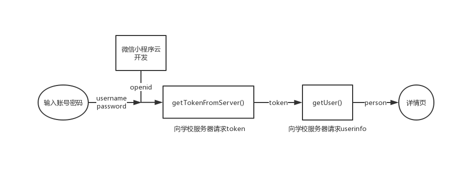

# 河南工业大学图书馆预约微信小程序复刻版 v1.0.3


## 整体介绍

```txt
本程序为图书馆预约系统小程序复刻版，其主要功能与WiseLibrary相同。本程序的优点主要有
```
* 界面简洁
* 操作逻辑优化
* 快速预约上一次的座位
* ~~清除违约~~


```txt
经研究发现，图书馆的系统采用了post/get提交JSON的形式进行数据传输，
并且在后端验证token和refer。这里的token与我们想象的不同，
一般来讲，token是一个变值，但是为了偷懒或者一些其他的原因，
导致图书馆的token是一个类似于js的长久保存值，这就十分不合理了。
除此之外图书馆的系统有提权漏洞，可通过特殊方式使用管理员的信息，
等待图书馆更新维护系统吧！！！
```

## 登陆方式

### 账号密码登录

```txt
本程序支持与图书馆相同的账号密码登录方式，具体流程如下图所示
```


### OpenID & Token登录（Android）

```txt
此方法需要root权限，可以下载Termux终端或者ES文件浏览器来进入Android根目录，
太极模块正在开发中，使用太极应该就很简单不用获取Root权限。根据反编译的
WiseLibrary我们可以发现该程序使用了一个固定的Token来表示登陆状态，
而这个token是使用wx.setStorage()函数存入缓存当中的，这十分的不安全。
根据排查可以发现该缓存文件为：
/data/data/com.tencent.mm/files/mmkv/AppBrandMMKVStorage1601335600 
在mmkv文件夹下还有另一个同名后缀为crc的文件。
该文件的作用是用来校验缓存文件，这两个文件缺一不可并且不可单独变化。
```
```txt
我们使用命令打开该文件，截取其中的内容
```

```cmd
 cat /data/data/com.tencent.mm/files/mmkv/AppBrandMMKVStorage1601335600
```
```txt
结果内容截取：
```
```json
++@@@TOTAL@DATA@SIZE@@@19wx31f64ed54d4615c0__openId'&String#34#o-
WiZ5UW7JxvQDbMSJPPhB3MTmpc)wx31f64ed54d4615c0++@@@TOTAL@DATA@SIZE@@@
53wx31f64ed54d4615c0__logs'&Array#33#[1574242251374,1574230663610])
wx31f64ed54d4615c0++@@@TOTAL@DATA@SIZE@@@
67(wxGlobal__exitState:wx31f64ed54d4615c0:~'
&#64#{"expireUnixTimestamp":1575451852}wxGlobal++@@@TOTAL@DATA@SIZE
@@@64*wxGlobal__riskWarning:wx31f64ed54d4615c0:~'&#66#{
"expireUnixTimestamp":1582018252}wxGlobal++@@@TOTAL@DATA@SIZE@
@@130wxGlobal++@@@TOTAL@DATA@SI
ZE@@@130wx31f64ed54d4615c0__token/.String#41#4ebd73db-6ffd-4
e61-b8cc-ae4f104fb226)wx31f64ed54d4615c0++
```

```txt
不难发现可以在其中找到 
```
* openId'&String#34#o-WiZ5UW7JxvQDbMSJPPhB3MTmpc
* token/.String#41#4ebd73db-6ffd-4e61-b8cc-ae4f104fb226

```txt
那接下来要做的只有填入信息了。强烈建议图书馆更改验证方式，嘿嘿。
```

## 函数接口

```txt
本程序主要的函数都在/common/region.js 文件中
```
|函数|解释|
|:-------------:|:-------------:|
|getRegion(time, token)|得到区域列表
|getSeat(time, position, token)|获取座位列表
|bookSeat(time, position, openid, seatid, token)|预定座位
|getBooking(openid, token)|获取预定信息
|leave(openid, bookingid, token)|离开
|leaveback(openid, bookingid, token)|返回
|cancel(openid, bookingid, token)|取消
|sign(openid, bookingid, token)|签到
|signoff(openid, bookingid, token)|签退
|getToken()|获取保存的token
|getTokenFromServer(openid, username, password)|重新获取token
|getUserAdmin(username,token)|获取用户列表
|disp()|取消绑定

## 官方API列表

```javascrpit
 domain_url: "https://wplib.haut.edu.cn/seatbook/",//主域名
    apiList: {                                     //API列表
        login: "api/seatbook/bindinguser",         //绑定用户
        queryOpenId: "api/seatbook/openid",        //查询openid 未测试
        getuserinfo: "api/seatbook/userinfo",      //获取用户信息
        unbinduser: "api/seatbook/unbindinguser",  //取消绑定用户
        getregionList: "api/seatbook/region",      //获取区域列表
        getseatList: "api/seatbook/query",         //获取座位列表
        addbooking: "api/seatbook/addbooking",     //预定座位
        mybooking: "api/seatbook/mybooking",       //获取预约记录
        signin: "api/seatbook/signin",             //签到
        signoff: "api/seatbook/signoff",           //签退
        leave: "api/seatbook/leave",               //离开
        leaveBack: "api/seatbook/leaveBack",       //返回
        keepon: "api/seatbook/keepon",             //续约
        cancelbooking: "api/seatbook/cancel",      //取消
        randomseat: "api/seatbook/random",         //随机座位 未测试
        bookingrule: "api/seatbook/rule",          //tips
        bookinginfo: "api/seatbook/bookinginfo",   //预定详情
        bookingrules: "api/sbookadmin/rulelist",   //规则表
        regionlist: "api/sbookadmin/regionlist",   //区域表
        regionop: "api/sbookadmin/regionoc",       //区域操作 未测试
        userlist: "api/sbookadmin/userlist",       //用户表
        clearall: "api/sbookadmin/clearall",       //清空所有违约 未测试
        clearone: "api/sbookadmin/clearone",       //清空个人违约
        bookinglist: "api/sbookadmin/bookinglist", //获取所有预定记录
        editrule: "api/sbookadmin/uprule",         //更新预约记录 未测试
        cancelbooking_admin: "api/sbookadmin/cancel",//管理员强制取消预定 测试失败
        beaconlist: "api/seatbook/beacon",         //查找附近蓝牙
        breakbooking: "api/seatbook/disobey"       //无代码 未知
        }
```

## request示例

```txt
一般来说在请求服务成功后 res.data.code 的值为 0 ，失败为500 或其他 并且在res.data.msg 中有消息提示
```

```javascript
wx.request({
      url: 'https://wplib.haut.edu.cn/seatbook/api/seatbook/addbooking',
      data: {
        starttime: time + dateString,
        endtime: time + ' 22: 00: 00',
        layerid: position.layerid,
        regionid: position.regionid,
        openid: openid,
        seatid: seatid,
      },
      header: {
        "Content-Type": "application/json",
        token: token  //token
      },
      success(res) {
        if (res.statusCode == 200) {
          if (res.data.code == 0) {
            return resl({
              code: 0,
              res: res
            })
          } else
            return rej({
              code: -1,
              res: res
            })
        } else {
          return rej({
            code: -1,
            res: res
          })
        }
      },
      fail(res) {
        return rej({
          code: -1,
          res: res
        })
      }
    })
  })
```

## 程序展示图


