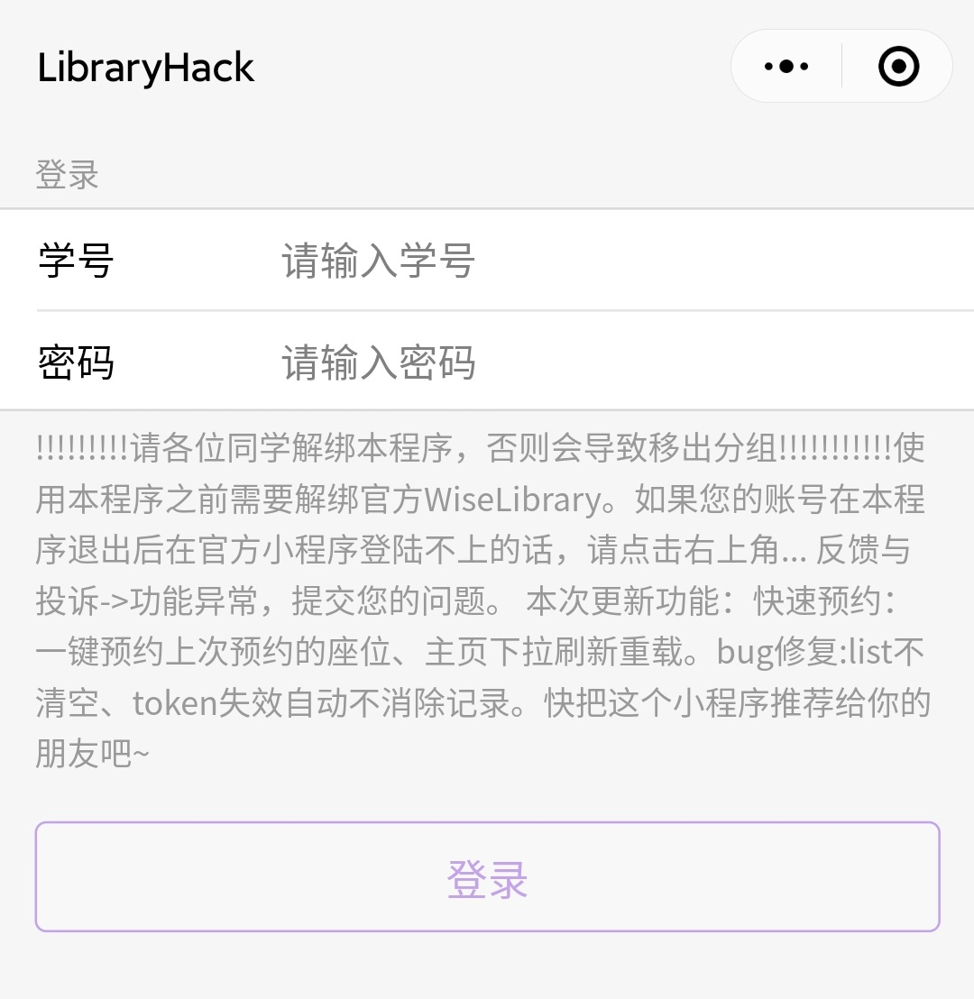
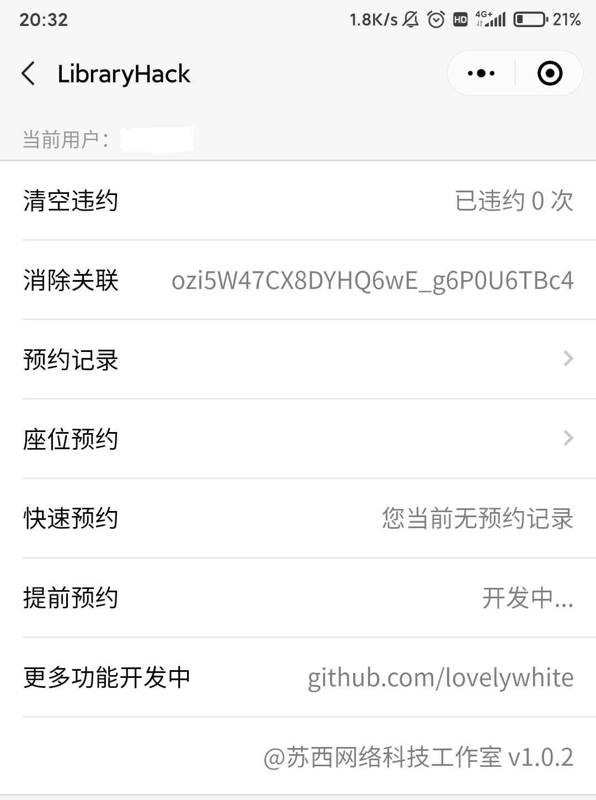
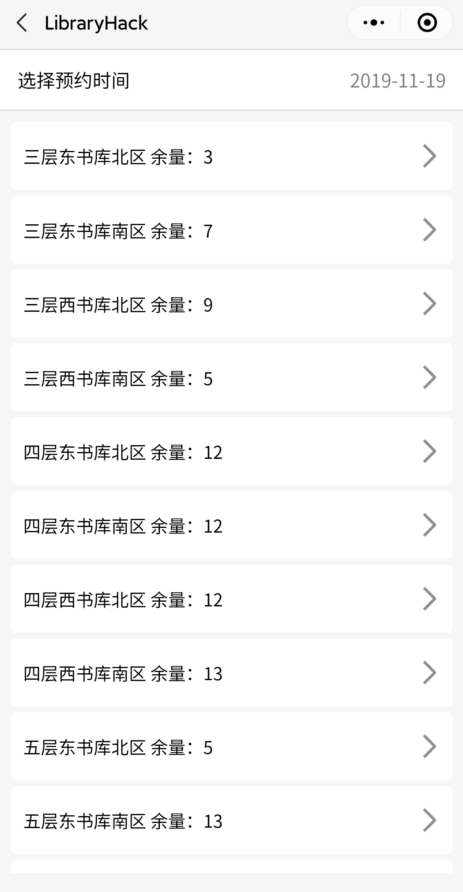

# 河南工业大学图书馆预约微信小程序复刻版 v1.0.3

<div style="text-align:center">


<p>小程序体验码</p>
</div>

## 整体介绍

```txt
    本程序为图书馆预约系统小程序复刻版，其主要功能与WiseLibrary相同。本程序的优点主要有
```
* 界面简洁
* 操作逻辑优化
* 快速预约上一次的座位
* ~~清除违约~~


```txt
    图书馆接口采用token存于本地的形式，我们只需要调用接口获取图书馆的token，之后每次请求将token以 token:'xxx'的形式存于headers中即可
```

## 函数接口

```txt
    本程序主要的函数都在/common/region.js 文件中
```
|函数| 解释|
|:-------------:|:-------------:|
|getRegion(time, token)|得到区域列表
|getSeat(time, position, token)|获取座位列表
|bookSeat(time, position, openid, seatid, token)|预定座位
|getBooking(openid, token)|获取预定信息
|leave(openid, bookingid, token)|离开
|leaveback(openid, bookingid, token)|返回
|cancel(openid, bookingid, token)|取消
|sign(openid, bookingid, token)|签到
|signoff(openid, bookingid, token)|签退
|getToken()|获取保存的token
|getTokenFromServer(openid, username, password)|重新获取token
|getUserAdmin(username,token)|获取用户列表
|disp()|取消绑定

## 程序展示图

<div style="text-align:center">






</div>


